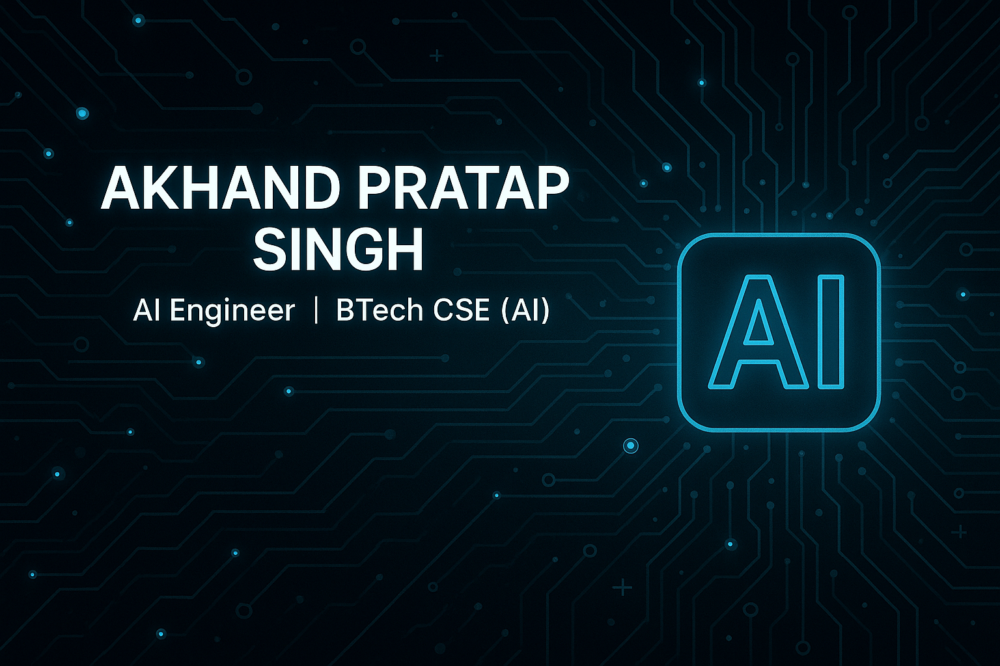

# 👋 Hi, I'm Akhand Pratap Singh  
### AI Engineer • BTech CSE (AI)

Welcome to my GitHub profile!  
I build AI systems, RAG pipelines, embeddings, and automation tools.

---

## 🎯 Focused Areas

- 🤖 **AI Engineering** — embeddings, RAG, vector search  
- 📄 **AI Document Assistants** — ChromaDB + HuggingFace  
- 🧠 **DSA Problem Solving** — 325+ LeetCode problems  
- 🛠 **Practical AI Tools** — Python automation & utilities  

---

## ⚙️ Tech Stack

**Languages:**  
Python • C++ • HTML • CSS  

**AI / ML:**  
NumPy • Pandas • Scikit-learn • HuggingFace • Vector Search • RAG  

**Tools:**  
Streamlit • Git • GitHub  

---

## 🚀 Featured Project

### **AI Document Assistant (RAG-based)**  
A local AI that reads documents, creates embeddings, stores them in ChromaDB, and answers questions using semantic search.

🔗 Repo → https://github.com/Akhand-3110/AI-Doc-Assistant

---

## 📊 GitHub Stats

---

## 🧩 LeetCode Progress

---

## 📫 Contact  
**Email:** akhandp765@gmail.com  
**LinkedIn:** https://www.linkedin.com/in/akhand-pratap-singh-1a7939307/  

---
